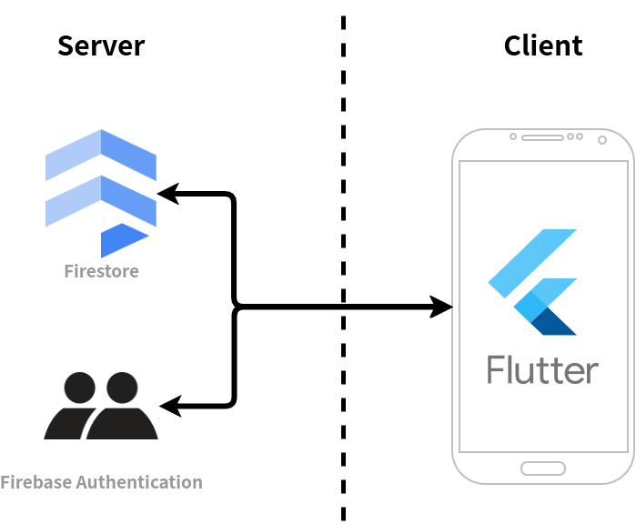
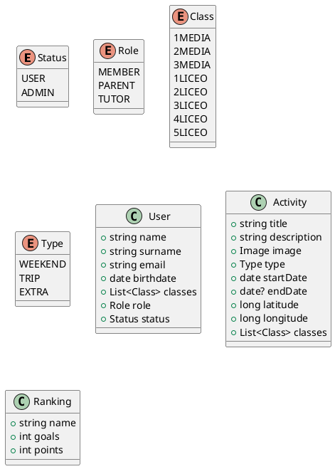

# Introduction

## Purpose

The main purpose of this document is the correct and complete requirement and design specification for the Tiber App for its future implementation, as well as the description of the testing plan to verify its correct functioning.

The Tiber App is designed as a companion app for the Tiber Club, a Rome-based soccer school and family association. Its main purpose is informing children and parents about the different activities organized by the association, as well as providing a leaderboard for children to compete, based on their performance in the soccer matches played by the club.

## Goals of the project

|             |                                                                                                                         |
| ----------- | ----------------------------------------------------------------------------------------------------------------------- |
| **[PG-01]** | Provide an easy to use and informative channel to inform parents and children of the activities organized in Tiber Club |
| **[PG-02]** | Provide a leaderboard in which children participating in the soccer school can compete based on their performance       |
| **[PG-03]** | Provide a list of birthdays of all  tutors and children participating in the soccer school so they can be celebrated    |
| **[PG-04]** | Provide an easy way of sharing the activities organized with people that might be interested in participating           |
| **[PG-05]** | Send timely and relevant notifications to inform of the activities organized in Tiber Club                              |

## Scope

The scope of the Tiber App project encompasses the specification, development, implementation and testing of a mobile app tailored for the Tiber Club to accomplish the goals described in the previous section.

To this end, the project's core functionalities will include extensive user management and fine-grained permissions, an event system to manage activities, a leaderboard system, a dynamic list of birthdays and integration with APIs services for location and weather information.

## Document structure

1. ***Introduction***: it aims to describe the environment of this project and its application domains. In particular, it focuses on the system characteristics and the goals that are going to be achieved with its development.
2. ***Overall description***: a high-level description of the system by focusing on the different scenarios that a user may go through during their interaction with the application, the functions the application must perform, the characteristics of the users, and the assumptions, dependencies and constraints that the application must respect.
3. ***Requirement specification***: a complete and formal specification of all requirements the application must comply with, as well as the design constraints and software system attributes.
4. ***Design specification***: a formal description of the architectural elements and patterns that will be used in the implementation of the application
5. ***Implementation and test plan***: a description of the technology and software choices selected to develop the application, as well as a comprehensive plan for its implementation and testing
6. ***References***: a list of reference documents used in the redaction of this document

## Revision history

| Ver. | Rev. | Date       | Comment         |
| ---- | ---- | ---------- | --------------- |
| 1    | 0    | 2024-05-12 | Initial version |

# Overall description

This section contains a high-level description of the application, based on the needs of the stakeholders. It describes the application as a series of scenarios that capture the functionality the users expect of the app, captures the functions the application will need to perform, analyzes the different types of users of the application and lists the assumptions, dependencies and constraints that need to be respected by the system.

## User characteristics

The system has four types of users, that correspond to the different roles within the Tiber Club:

- **Member (Ragazzo)**: a kid participating in activities organized by Tiber Club. They are associated with a specific "level" which corresponds to their class level in school (1º to 3º Media and 1º to 5º Liceo). They should only be able to read the information and activities of their level.
- **Parent (Genitore)**: a parent of one or more kids participating in activities organized by Tiber Club. They can be associated with more than one level to be able to see activities for all their kids, if they have more than one. They should still only be able to read the information.
- **Tutor**: an organizer of activities in Tiber Club. The can be associated with more than one level if they manage activities for those levels. They can add, edit and delete content in the app.
- **Administrator**: the administrator of the application. Can approve new accounts. It is independent from the other three types, meaning any of the other three types may also be administrator.

## Scenarios

### [SC-01] A member wants to be updated on all activities organized

Alessandro is a kid currently attending 1º Liceo and a member of Tiber Club. He can open the app and see all the activities programmed for his level. For each activity, he can see the title of the activity, a picture, the type (a weekend plan, a trip, or an extra activity), the date or dates, the location, the levels that can participate in that activity and a description detailing the activity.

### [SC-02] A parent wants to be updated on all activities organized

Alice is a mother of two kids, both members of Tiber Club. None of them have a phone yet. She can open the app and see the activities organized for both her kids, with the same details as a kid. She can share this information with her kids, or lend them the phone so they can see the plans themselves. With this information she can also plan the week and the trips she has to make so the kids can attend the activities.

### [SC-03] An user of the app wants to invite a friend to an activity in Tiber Club

Alessandro wants to invite one of his school friends to a soccer match organized in Tiber Club. He can easily share the details of the activity through Whatsapp or other messaging platforms by using the share button in the activity details screen, which will compose a small text with everything important and present the system share sheet so it can be shared.

### [SC-04] A tutor wants to create a new activity

Mario is a tutor at Tiber Club. He wants to create a new activity for the level he manages. He can go into the app and press the "Create activity" button. He will choose between the three different types of activities (a weekend plan, a trip, or an extra activity), and add a title, a description, a picture, a location (optional) and a date or dates (depending on the type of activity he chooses), as well as the levels that can participate in this activity.

### [SC-05] A tutor wants to modify an activity

Mario created an activity at an specific venue, but the venue was not available for that day and time, so he finds a new venue and makes a reservation there instead. He can then go into the app and edit the details of the activity, specifically the location, to reflect the changes.

### [SC-06] A tutor wants to cancel an activity

Michele is a tutor at Tiber Club. He organized a trekking activity, but due to the weather he needs to cancel it. He can go to the app, select that activity and easily cancel it. It will disappear from the members and parents apps.

### [SC-07] A member or a parent wants to be notified of new activities

Vittorio is a kid currently attending 2º Liceo. He wants to be notified of the activities that happen in Tiber Club so he can be informed. He can activate notifications, accepting them through the system dialog when he opens the app for the first time, and he will be notified when a new activity for his level is created. 

### [SC-08] A member or a parent wants to be notified when an activity is modified or cancelled

Enrico is a father of three kids, all members of Tiber Club. He has a difficult schedule and needs to be notified when activities his kids want to attend to get modified or cancelled. He can activate notifications, accepting them through the system dialog when he opens the app for the first time, and he will be notified instantly when an activity in the levels of his kids is modified or cancelled so he can modify his schedule accordingly.

### [SC-09] An user of the app wants to know the weather for a particular activity

Vittorio wants to go to a trip to Torino organized by Tiber Club. When packing for the trip, he does not know whether he should bring an umbrella. He can open the app and go to the trip activity screen, and see the weather in Torino for the days of the trip, and so he can see that he should definitely bring the umbrella because in Torino it always rains.

### [SC-10] A member wants to see their position in the rankings

Alessandro has been participating in all soccer matches organized by Tiber Club. The tutors have been counting his goals and points and entering them in the app. He can go into the ranking screen of the app and see his position in relation to all the other members of Tiber Club.

### [SC-11] A tutor wants to add a person to the rankings

Michele has organized a soccer match and three new kids have come. He can add them to the rankings with the goals they scored, independently of whether they have an account in the app or not, since not all of them have a phone.

### [SC-12] A tutor wants to add goals and points to a person in the rankings

Alessandro has scored three goals in the soccer match, and Michele wants to add them to Alessandro's count in the app. He can open the app, go to the ranking screen, and add goals to Alessandro's score.

### [SC-13] An user wants to see the birthdays coming up

Michele wants to know the birthdays of the kids in his level so he can send them a message of Happy Birthday. He can open the app, go to the birthdays screen, and see all the birthdays of all members and tutors, but not those of parents.

### [SC-14] A new member wants to join the app

Giovanni is a member of Tiber Club, and has just received his first phone for his birthday. He wants to join the app, so he downloads it and creates a new account with his personal details. He is greeted with a waiting screen until his account is approved by an administrator. Once he is approved, he can use the app normally.

### [SC-15] An administrator wants to screen new users

Gabriele is the director of Tiber Club. He wants to let into the app only the members and parents of Tiber Club, and to stop external people from joining the app without being members. He can open the user screening page in the app and see new accounts created. He will also receive a notification when a new account is created. He can check the details of the account, give them the necessary roles, add them to the levels the appertain to, and accept them. He can also reject users, impeding them from accessing the information in the app.

### [SC-16] An user of the app wants to eliminate their account

Paolo has finished 5º Liceo and will not be a member of Tiber Club next year. He can delete his account from the profile page of the app, and uninstall it. A tutor can also delete Paolo from the ranking.

## Functions

From the set of scenarios described above, a set of functions the app must perform can be distilled:

| Code        | Function                                                  | Comments                                                                      |
| ----------- | --------------------------------------------------------- | ----------------------------------------------------------------------------- |
| **[FN-01]** | Creating account                                          | Account will not be usable until approved                                     |
| **[FN-02]** | Deleting account                                          | -                                                                             |
| **[FN-03]** | Screening created accounts                                | In the approval process the role and levels are added                         |
| **[FN-04]** | Notifying of account creation                             | Only to administrators                                                        |
| **[FN-05]** | Displaying activities                                     | -                                                                             |
| **[FN-05]** | Adding activities                                         | Only by tutors                                                                |
| **[FN-06]** | Modifying activities                                      | Only by tutors                                                                |
| **[FN-07]** | Deleting activities                                       | Only by tutors                                                                |
| **[FN-08]** | Displaying weather in activities                          | If the activity is more than one day long, display the average weather        |
| **[FN-09]** | Sharing activities                                        | Using system dialog for greater compatibility                                 |
| **[FN-10]** | Notifying of activity creation, modification and deletion | Only to the people of the level of the activity                               |
| **[FN-11]** | Displaying ranking                                        | -                                                                             |
| **[FN-12]** | Adding people to ranking                                  | Only by tutors, independent of whether the person added has an account or not |
| **[FN-13]** | Modifying goals and points of people in rankings          | Only by tutors                                                                |
| **[FN-14]** | Deleting people from rakings                              | Only by tutors                                                                |
| [FN-15]     | Showing birthdays                                         | Only of members and tutors                                                    |

## Assumptions, dependencies and constraints

### Assumptions

In this section, we outline the foundational beliefs upon which the design and functionality of the Tiber App are based. These assumptions serve as guiding principles for understanding user behavior, technological capabilities, and organizational dynamics that shape the app's development and usage.

|             |                                                                                                          |
| ----------- | -------------------------------------------------------------------------------------------------------- |
| **[AS-01]** | The user has access to the Internet                                                                      |
| **[AS-02]** | The user has a device capable of running the app                                                         |
| **[AS-03]** | Users are interested in staying updated about the activities of the Tiber Club                           |
| **[AS-04]** | Parents are actively involved in managing their children's participation in the soccer school            |
| **[AS-05]** | Members are motivated to compete and improve their soccer skills through the app's leaderboard           |
| **[AS-06]** | The Tiber Club has a sufficient number of soccer matches and activities to keep the app content relevant |
| **[AS-07]** | The app will be primarily used by families associated with the Tiber Club                                |

### Dependencies

This section identifies the external factors and systems upon which the successful operation of the Tiber App relies. By understanding these dependencies, we can prioritize integration efforts and ensure seamless communication between the app and other essential components of the Tiber Club's ecosystem.

|             |                                                                                                                                            |
| ----------- | ------------------------------------------------------------------------------------------------------------------------------------------ |
| **[DP-01]** | Access to a database to retrieve and update activities and leaderboard data                                                                |
| **[DP-02]** | Collaboration with the Tiber Club's administration to ensure accurate and timely communication of club-related information through the app |
| **[DP-03]** | Compatibility with various mobile operating systems (iOS, Android) to reach a wide audience of users                                       |
| **[DP-04]** | Availability of resources (time, budget, personnel) for app development, maintenance, and support                                          |
| **[DP-05]** | Access to a weather API to obtain data to display on activities                                                                            |
| **[DP-06]** | Access to a map API                                                                                                                     |

### Constraints

In this section we acknowledge the limitations and boundaries that influence the design, implementation, and operation of the Tiber App. These constraints encompass technical, regulatory, and practical considerations that must be navigated to deliver a functional and compliant mobile solution aligned with the goals of the Tiber Club and its community.

|             |                                                                                                                                                         |
| ----------- | ------------------------------------------------------------------------------------------------------------------------------------------------------- |
| **[CN-01]** | Limited screen space on mobile devices may constrain the design and layout of the app's user interface                                                  |
| **[CN-02]** | Privacy and security concerns regarding the collection and storage of personal information, especially for children using the app                       |
| **[CN-03]** | Adherence to regulatory requirements, such as GDPR                                                                                                      |
| **[CN-04]** | The need for regular updates and maintenance to ensure the app remains functional and relevant admits evolving technology and user expectations         |
| **[CN-05]** | Performant adaptations to factors such as network latency or device hardware limitations, particularly in areas with poor connectivity or older devices |

# Requirement specification

This section of the document provides a complete specification of the requirements the app for Tiber Club must comply with. The requirements are separated in functional requirements, interface requirements, performance requirements, design constraints and system attributes.

## Functional requirements

Here we define the functional requirements of the application, obtained from the functions described in the section above.

|             |                                                                                                                                              |
| ----------- | -------------------------------------------------------------------------------------------------------------------------------------------- |
| **[FR-01]** | Users must be able to create an account.                                                                                                     |
| **[FR-02]** | Users should have the ability to delete their account.                                                                                       |
| **[FR-03]** | Newly created accounts must undergo screening and approval, with assigned roles and levels.                                                  |
| **[FR-04]** | Administrators should receive notifications of new account creations.                                                                        |
| **[FR-05]** | Users can view existing activities.                                                                                                          |
| **[FR-06]** | Tutors can add, modify, and delete activities for their levels.                                                                              |
| **[FR-07]** | Weather information should be displayed for activities, especially if multi-day events.                                                      |
| **[FR-08]** | Users can share activity details through the system dialog.                                                                                  |
| **[FR-09]** | Users receive notifications for activity creation, modification, and deletion, restricted to individuals associated with the activity level. |
| **[FR-10]** | Users can view rankings.                                                                                                                     |
| **[FR-11]** | Tutors have the authority to add individuals to rankings, regardless of account status.                                                      |
| **[FR-12]** | Tutors can modify goals and points of individuals within rankings.                                                                           |
| **[FR-13]** | Tutors can remove individuals from rankings.                                                                                                 |
| **[FR-14]** | Users can view a list of birthdays of members and tutors                                                                                     |

## Interface requirements

This section details the interface requirements of the application for Tiber Club, divided by their type.

### Hardware interfaces

|             |                                                                                                               |
| ----------- | ------------------------------------------------------------------------------------------------------------- |
| **[HI-01]** | The app should be compatible with various screen sizes and resolutions commonly found in smartphones.         |
| **[HI-02]** | The app should support touch gestures for navigation and interaction, such as tapping, swiping, and pinching. |

### Software interfaces

|             |                                                                                                                                                                                                            |
| ----------- | ---------------------------------------------------------------------------------------------------------------------------------------------------------------------------------------------------------- |
| **[SI-01]** | The app should be compatible with both iOS and Android operating systems, supporting the latest versions as well as some older versions to ensure broader accessibility                                    |
| **[SI-02]** | The app needs to interface with a database system to store and retrieve user account information, activity data, and ranking details                                                                       |
| **[SI-03]** | Integration with a weather API is required to fetch real-time weather information for activities, if available                                                                                             |
| **[SI-04]** | Integration with a notification service (e.g., Firebase Cloud Messaging for Android, Apple Push Notification Service for iOS) to send push notifications to users regarding account activities and updates |

### Communication interfaces

|             |                                                                                                                                                                      |
| ----------- | -------------------------------------------------------------------------------------------------------------------------------------------------------------------- |
| **[CI-01]** | The app requires an active internet connection for real-time data synchronization, account authentication, and communication with external services                  |
| **[CI-02]** | The app needs to communicate with the Tiber Club's database via RESTful APIs or other methods to fetch and update data related to activities, accounts, and rankings |
| **[CI-03]** | Utilize system dialogs for sharing activities to ensure compatibility across different devices and platforms                                                         |

## Performance requirements

The performance requirements for the Tiber App are critical to ensure a seamless user experience and efficient operation. The app should be responsive and performant across different devices and network conditions. Response times for key interactions such as account creation, activity management, and ranking updates should be minimal to keep users engaged.

Load times for content such as activity details and ranking information should be optimized to provide a smooth browsing experience. The app should handle concurrent user interactions gracefully without slowdowns or crashes, even during peak usage times.

In terms of data transfer, the app should minimize the amount of data exchanged between the client and server to conserve bandwidth and reduce latency. Efficient caching mechanisms should be implemented to store frequently accessed data locally and minimize network requests.

Additionally, the app should be robust and resilient to network fluctuations, gracefully handling scenarios such as intermittent connectivity or server downtime. Error handling mechanisms should provide informative and user-friendly messages to guide users in case of unexpected situations.

## Design constraints

The design constraints listed in this section serve as guidelines and limitations that influence the visual and interactive aspects of the Tiber App, ensuring that the design is both functional and user-friendly within the specified constraints.

|             |                                                                                                                                                                                                                                                     |
| ----------- | --------------------------------------------------------------------------------------------------------------------------------------------------------------------------------------------------------------------------------------------------- |
| **[DC-01]** | The app's user interface must be designed to accommodate various screen sizes and resolutions, ensuring a consistent and visually appealing layout across different smartphone sizes.                                                               |
| **[DC-02]** | The design must prioritize essential information and functionality, avoiding clutter and excessive scrolling.                                                                                                                                       |
| **[DC-03]** | The app's interface should be optimized for touch interactions, with sufficient touch targets and intuitive gestures to facilitate easy navigation and interaction, especially for younger users.                                                   |
| **[DC-04]** | The design should adhere to accessibility guidelines to ensure that all users, including those with disabilities, can effectively navigate and use the app's features. This includes considerations for text size and color contrast, among others. |
| **[DC-05]** | The app's design should maintain consistency with the branding and visual identity of the Tiber Club, including logo usage, color schemes, and typography, to reinforce brand recognition and trust.                                                |
| **[DC-06]** | The design must incorporate measures to safeguard user data and privacy, including secure authentication methods, encryption of sensitive information, and compliance with relevant data protection regulations.                                    |
| **[DC-07]** | The design should be scalable to accommodate future growth and additional features, allowing for easy integration of new functionalities and enhancements without requiring significant redesign.                                                   |

## Software system attributes

In crafting the Tiber App, it's imperative to delineate the essential attributes and requirements that govern its software architecture and functionality. This section delineates the core principles and specifications that underpin the app's reliability, availability, security, maintainability, and portability. By articulating these fundamental characteristics, we set the stage for a robust, user-centric, and sustainable mobile application that meets the needs of both the Tiber Club and its diverse community of users.

### Reliability

|             |                                                                                                                                                  |
| ----------- | ------------------------------------------------------------------------------------------------------------------------------------------------ |
| **[RR-01]** | The Tiber App should operate reliably under normal conditions, minimizing the occurrence of failures or errors that disrupt user experience.     |
| **[RR-02]** | The app should have robust error handling mechanisms to gracefully handle unexpected situations and provide informative error messages to users. |

### Availability

|             |                                                                                                                                                               |
| ----------- | ------------------------------------------------------------------------------------------------------------------------------------------------------------- |
| **[AR-01]** | The Tiber App should be available for use whenever users require access, minimizing downtime and service interruptions.                                       |
| **[AR-02]** | The app's backend infrastructure should have redundancy and failover mechanisms in place to ensure high availability, with a target uptime of at least 99.9%. |

### Security

|             |                                                                                                                                                            |
| ----------- | ---------------------------------------------------------------------------------------------------------------------------------------------------------- |
| **[SR-01]** | The Tiber App must prioritize the security and confidentiality of user data, protecting against unauthorized access, data breaches, and malicious attacks. |
| **[SR-02]** | The app should implement secure authentication mechanisms, such as password hashing and encryption, to safeguard user accounts and sensitive information.  |
| **[SR-03]** | Data transmission between the app and server should be encrypted using industry-standard protocols (e.g., HTTPS) to prevent interception and tampering.    |

### Maintainability

|             |                                                                                                                                                                                              |
| ----------- | -------------------------------------------------------------------------------------------------------------------------------------------------------------------------------------------- |
| **[MR-01]** | The Tiber App should be designed and implemented in a way that facilitates easy maintenance, updates, and enhancements over time, reducing the cost and effort required for ongoing support. |
| **[MR-02]** | The app's codebase should follow coding best practices and be well-documented to enable efficient debugging, troubleshooting, and code review processes.                                     |
| **[MR-03]** | Modular architecture and separation of concerns should be employed to allow for isolated updates and changes to specific components without affecting the entire system.                     |

### Portability

|             |                                                                                                                                                                                     |
| ----------- | ----------------------------------------------------------------------------------------------------------------------------------------------------------------------------------- |
| **[PR-01]** | The Tiber App should be portable across different devices, platforms, and environments, enabling users to access the app seamlessly regardless of their device or operating system. |
| **[PR-02]** | The app should be developed using cross-platform frameworks or technologies that support deployment on both iOS and Android platforms with minimal modifications.                   |
| **[PR-03]** | The app's user interface should adapt gracefully to different screen sizes and resolutions, maintaining usability and visual consistency across various devices.                    |

# Design specification

This section provides a description of the key components of the system’s architecture,
specifies their interactions, and outlines the chosen replication mechanism adopted to
distribute the system effectively.

## Overview

The application will be developed with a Client-Server architecture, albeit a very monolithic one, as the server will only include the database and authentication, leaving the business logic and presentation in the client.

The communication between the client and the server is performed through a REST API provided by the storage and database provider Firebase.  

## Component view

As described in the section above, the app connects through a common interface to the Firebase services, namely, the Firestore Database, the Authentication service and the Notification API. Specific components of the application connect to external APIs to obtain the necessary data.

The app is roughly divided between a logic component, that performs the interfacing with the database and external services, and a presentation component, that builds and controls the user interface. The presentation component is further divided into the activities, tournament and account components.

## Deployment view

The deployment view offers a comprehensive overview of how the various components constituting the system are distributed and deployed across diverse physical or virtual environments. When examining the deployment view of the Tiber Club application, one can discern the arrangement of its backend elements, chiefly comprised of Firebase services and external APIs, juxtaposed with the application itself establishing connections to these components via HTTPS protocols.

In this configuration, numerous instances of the application, potentially one per user, may operate concurrently, each seamlessly interfacing with the backend services. This distributed setup ensures scalability and robustness, allowing the Tiber Club app to accommodate varying levels of usage while maintaining reliability and responsiveness.

## Data model

This diagram describes the different data types that conform the data model of the application, as well as the enumerate classes that support them.

It is important to mention that, since the data for the app will be stored in a NoSQL database, the data model described here lacks relations, characteristic only to relational data models.

## External services

The application will make use of two external services, not counting the database backend:

- **Weather API**: the application requires a weather data API to display data related to the weather in the time and place of the activities. The API should be able to provide, given a latitude and longitude and a date or series or dates, the weather for that date or dates (sunny, cloudy, rainy, etc...) and the maximum and minimum temperatures. Given the weather data might be not available for dates far into the future, the app should handle gracefully the lack of data.
- **Location API**: the application requires a location API to let tutors select the location of activities. It needs to provide a search service that can return, given a string that represents a place, a specific address and coordinates of said place.

## Interface design

The interface design of the Tiber App tries to capture the essence of modernity, simplicity, and usability. Drawing inspiration from the latest design trends, the app will be crafted using Google's Material 3 design system, ensuring a sleek and contemporary visual experience.

With Material 3 as our guiding principle, the interface will feature clean lines, bold colors, and intuitive interactions, providing users with a seamless and delightful experience. Every element, from buttons to navigation menus, will be meticulously designed to prioritize ease of use and accessibility.

The user interface will be thoughtfully organized to streamline navigation and enhance usability, allowing users to effortlessly discover activities, track rankings, and engage with community updates. No matter the size of screen, the Tiber App's interface will adapt gracefully to various screen sizes and resolutions, ensuring a consistent and visually appealing experience across devices.

# Implementation and test plan

This section of the document goes over the implementation of the platform following the requirements and design specification detailed in the previous sections, and its subsequent testing.

## Implementation

The initial phase of app implementation involves careful consideration and selection of the most suitable technology, weighing the merits and drawbacks of each option available.

### Languages and Frameworks

After thorough evaluation, Flutter emerges as the preferred framework for this project, harnessing the power of the Dart programming language. Renowned for its adaptability, Flutter offers a rich library ecosystem, granting developers access to a plethora of tools and functionalities. Its standout feature lies in simplifying cross-platform application development, facilitating seamless deployment across diverse operating systems and devices. With its robust capabilities, Flutter proves to be an ideal choice for crafting dynamic and responsive mobile applications effortlessly.

While exploring alternatives, React Native was briefly considered but ultimately dismissed due to the complexities associated with JavaScript and its comparatively slower performance.

### Database Selection

The chosen database for this project must fulfill specific criteria, including NoSQL compatibility, support for file and image storage, adherence to stringent security protocols, and seamless integration with the selected framework.

Among the contenders, Firebase and Supabase emerged as the top contenders, offering comparable functionality and features. Ultimately, Firebase was selected for its close alignment with the Flutter ecosystem and its established reputation within the industry, overshadowing Supabase, a relative newcomer.

### Authentication Provider

Firebase's built-in authentication services, seamlessly integrated with the chosen database, further solidified its selection over Supabase. This intrinsic capability adds another layer of convenience and security to the project's infrastructure.

### External APIs

#### Weather API

In the selection of the Weather API, Open-Meteo emerged as the prime choice. Renowned for its open-source nature, Open-Meteo provides free access for non-commercial purposes, eliminating the need for an API key and thereby simplifying its integration.

#### Location API

The Location API serves a crucial role in facilitating location-based functionalities, particularly in location search, autocomplete and display for Tiber Club activities. While Google Maps stands out as a prominent option in the realm of location services, its costliness and absence of a free plan, coupled with an overwhelming array of features, rendered it less than ideal for this project's requirements. Consequently, LocationIQ emerged as the preferred alternative. Leveraging the wealth of data from OpenStreetMap, LocationIQ offers a free tier that fulfills the project's needs aptly, striking a balance between functionality and affordability.

## Test plan

Formal unit testing was not prioritized due to the application's modest scale and simplicity. Instead, informal testing methods were deemed sufficient, yielding comparable results. Similarly, formal integration testing was deemed impractical given the intricate inter-dependencies among components and the inherent challenges associated with formally testing user interfaces. Consequently, all interactions with the application were subjected to informal testing processes.

Beta testing, however, played a pivotal role in ensuring the application's robustness and usability. Approximately 40 individuals, comprising various roles within the Tiber Club, actively participated in the beta testing phase. Over the course of several months, these testers installed and utilized the application, diligently reporting any encountered bugs or issues. Subsequently, numerous fixes were implemented, predominantly aimed at refining and enhancing the overall user experience.

# References

- [Material Design documentation](https://m3.material.io/)
- [LocationIQ documentation](https://docs.locationiq.com/)
- [Firebase documentation](https://firebase.google.com/docs/)
- [Flutter documentation](https://docs.flutter.dev/)
- [Open-Meteo API documentation](https://open-meteo.com/en/docs)